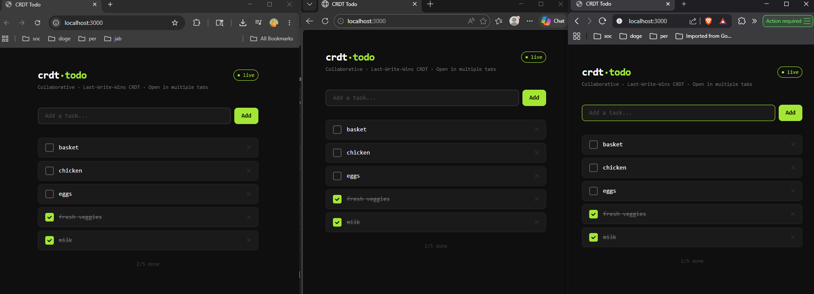

# CRDT Collaborative Todo App




A minimal real-time collaborative todo app using **LWW-CRDT** (Last-Write-Wins).  
Backend: **FastAPI + WebSockets** | Frontend: **Next.js 14 + Tailwind**

---

## Project Structure

```
crdt-todo/
├── backend/
│   ├── main.py           # FastAPI app, CRDT logic, WebSocket
│   └── requirements.txt
└── frontend/
    ├── app/
    │   ├── layout.tsx
    │   ├── page.tsx      # Main UI
    │   └── globals.css
    ├── hooks/
    │   └── useCrdtTodos.ts  # CRDT hook
    ├── package.json
    ├── tsconfig.json
    ├── tailwind.config.ts
    └── postcss.config.js
```

---

## How it works (CRDT)

- Each todo has a unique `id` and a `timestamp`.
- On every add/toggle/delete, a new `timestamp = Date.now()` is generated.
- When two clients edit the same todo, the one with the **higher timestamp wins** (LWW).
- The backend applies the same rule and broadcasts accepted ops to all clients.
- New clients receive the full state snapshot on connect (`init` message).

---

## Setup

### 1. Backend

```bash
# From project root
cd crdt-todo/backend

python -m venv venv
source venv/bin/activate        # Windows: venv\Scripts\activate

pip install -r requirements.txt

uvicorn main:app --reload --port 8000
```

Backend runs at: http://localhost:8000  
WebSocket at:    ws://localhost:8000/ws

---

### 2. Frontend

```bash
# Open a new terminal, from project root
cd crdt-todo/frontend

npm install
npm run dev
```

Frontend runs at: http://localhost:3000

---

## Test Collaboration

1. Open **http://localhost:3000** in two browser tabs (or windows).
2. Add a todo in one tab — it appears instantly in the other.
3. Toggle or delete in any tab — syncs in real time.
4. **CRDT in action**: Both tabs show a `ts:` timestamp on hover — higher timestamp always wins on conflict.

---

## API

| Method | Path     | Description          |
|--------|----------|----------------------|
| GET    | /todos   | Get all active todos |
| GET    | /health  | Health check         |
| WS     | /ws      | WebSocket connection |

### WebSocket messages

**Client → Server**
```json
{ "type": "upsert", "todo": { "id": "...", "text": "...", "done": false, "timestamp": 1234567890 } }
{ "type": "delete", "todo": { "id": "...", "timestamp": 1234567890 } }
```

**Server → Client**
```json
{ "type": "init",  "todos": [...] }   // on connect
{ "type": "op",    "op": { ... } }    // on any accepted change
```
